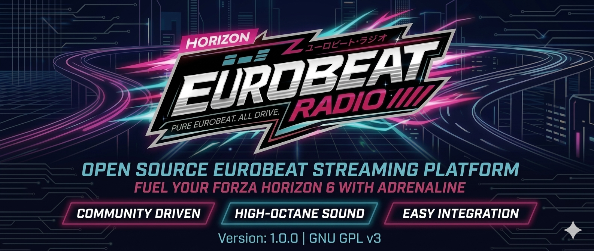
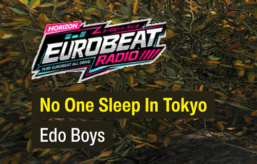
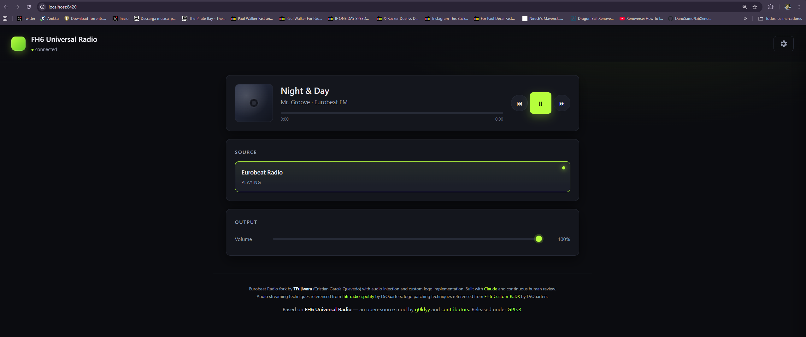

# 🎵 Eurobeat Radio for Forza Horizon 6

A specialized fork of **FH6 Universal Radio** configured exclusively for **Eurobeat streaming** with a custom Eurobeat logo and simplified dashboard.

# 🎮 In-game picture

# 🌐 Web dashboard

## Features

✨ **Eurobeat-Focused:**
- Pre-configured to stream Eurobeat radio from `stream.laut.fm/eurobeat`
- Custom Eurobeat logo replacing the default Horizon Opus station
- Simplified dashboard showing only playback controls and volume
- No configurable sources or settings exposure

🔧 **Based on FH6 Universal Radio:**
- Full in-game radio integration with proper audio routing
- Live web dashboard at `http://localhost:8420`
- Responsive browser UI for track control and volume adjustment
- Audio synchronizes with game menus and in-game volume

## Installation (Easiest Way)

### Automatic Installation

1. **Download** `eurobeat-radio.zip` from [Releases](https://github.com/TFujiwara/eurobeat-radio/releases)
2. **Extract** the ZIP to any folder
3. **Right-click** `install.ps1` → **Run with PowerShell**
   - If you get a security error, run: `Set-ExecutionPolicy -ExecutionPolicy Bypass -Scope Process`
   - Then run the script again
4. The script will find your FH6 and install automatically
5. **Launch** Forza Horizon 6

### Manual Installation (Alternative)

If PowerShell doesn't work:

1. Download `eurobeat-radio.zip` from [Releases](https://github.com/TFujiwara/eurobeat-radio/releases)
2. Close Forza Horizon 6
3. Extract the ZIP into your FH6 folder (next to `forzahorizon6.exe`). Overwrite when prompted.
4. Launch the game

### Using the Dashboard

1. Tune the in-game radio to the **Eurobeat station** (should be **R9**)
2. Open `http://localhost:8420` in your browser
3. Control playback: play/pause, skip, volume

**From another device on the network:** use your PC's IP address, e.g. `http://192.168.1.42:8420`

## Uninstall

- Delete `version.dll` from the game directory
- Delete the `fh6-radio` folder
- Run **Verify integrity** in Steam/Xbox to restore original files

## Credits

**Eurobeat Radio fork** by **TFujiwara** (Cristian García Quevedo)
- Built with [Claude](https://claude.ai) and continuous human review
- Audio streaming techniques from [fh6-radio-spotify](https://github.com/DrQuarters/fh6-radio-spotify) by DrQuarters
- Logo patching techniques from [FH6-Custom-RaDX](https://github.com/DrQuarters/FH6-Custom-RaDX) by DrQuarters

**Based on** [FH6 Universal Radio](https://github.com/g0ldyy/fh6-universal-radio) by [g0ldyy](https://github.com/g0ldyy) and contributors, released under GPLv3.

## License

This project is licensed under **GNU General Public License v3.0** ([LICENSE](LICENSE)).

You're free to use, modify, and redistribute; derivatives must remain GPLv3 and credit the original projects.

### Disclaimer

Unofficial fan-made mod. Not affiliated with Turn 10 Studios, Playground Games, Xbox Game Studios, Microsoft, or the radio services used. All trademarks belong to their respective owners. Use at your own risk.
